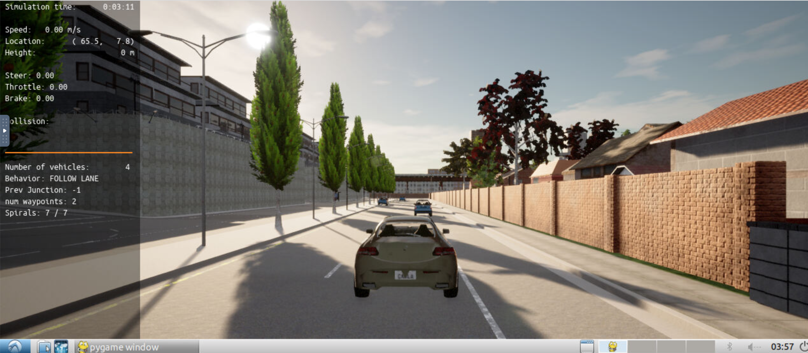
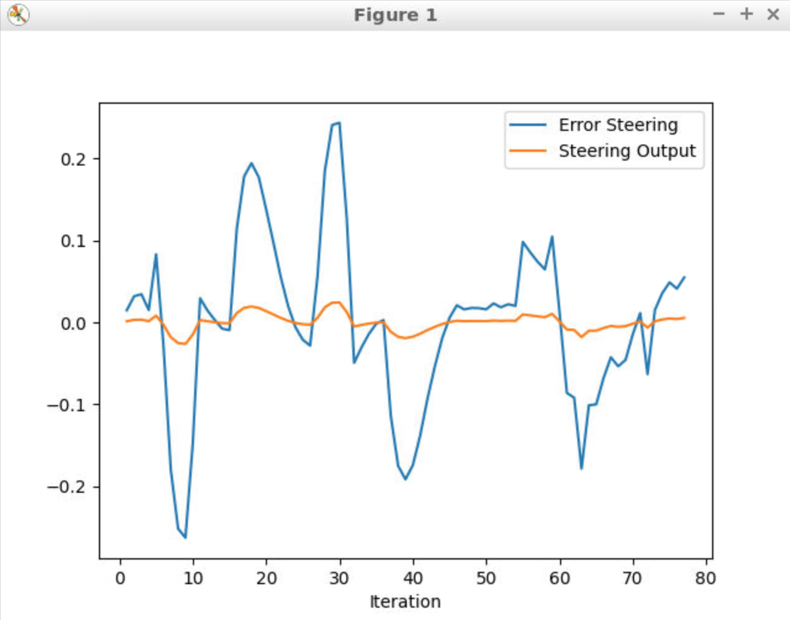
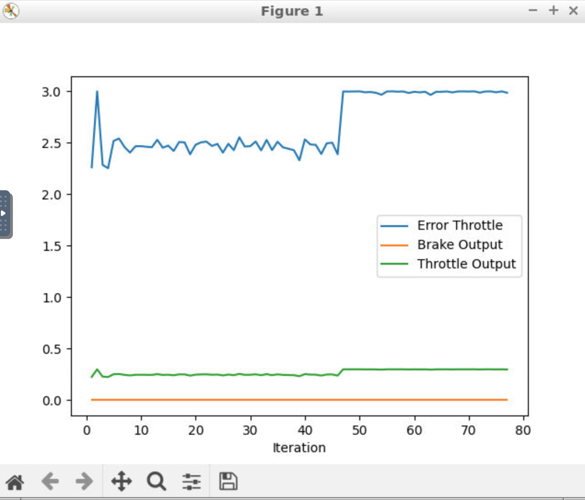
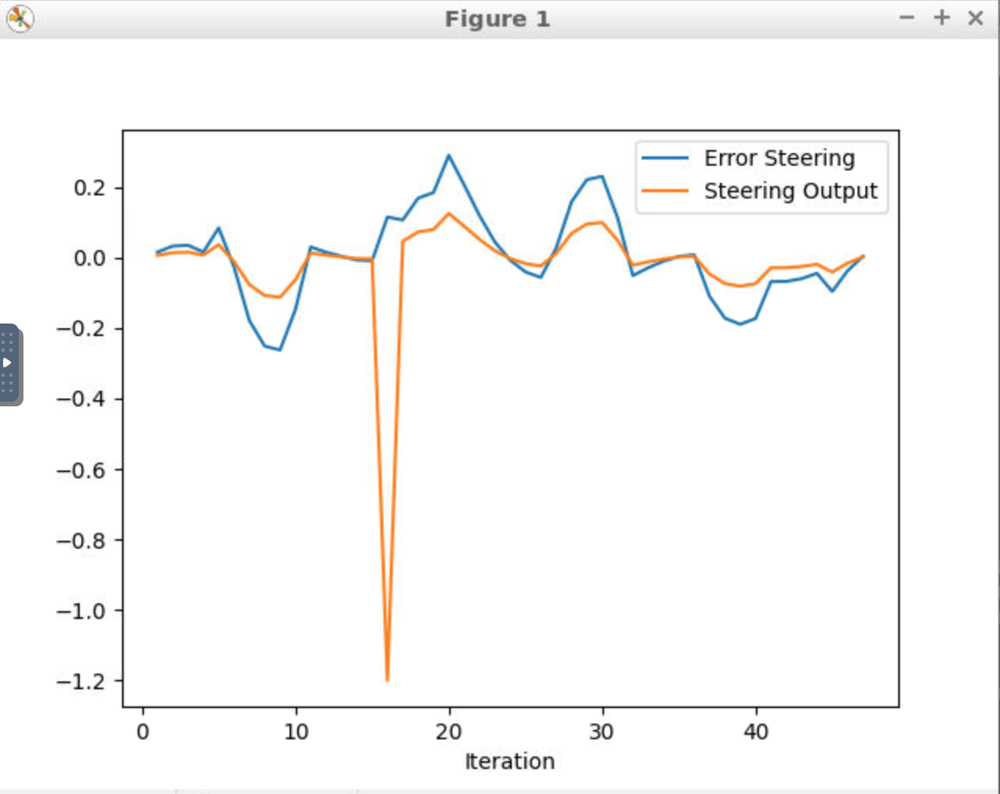
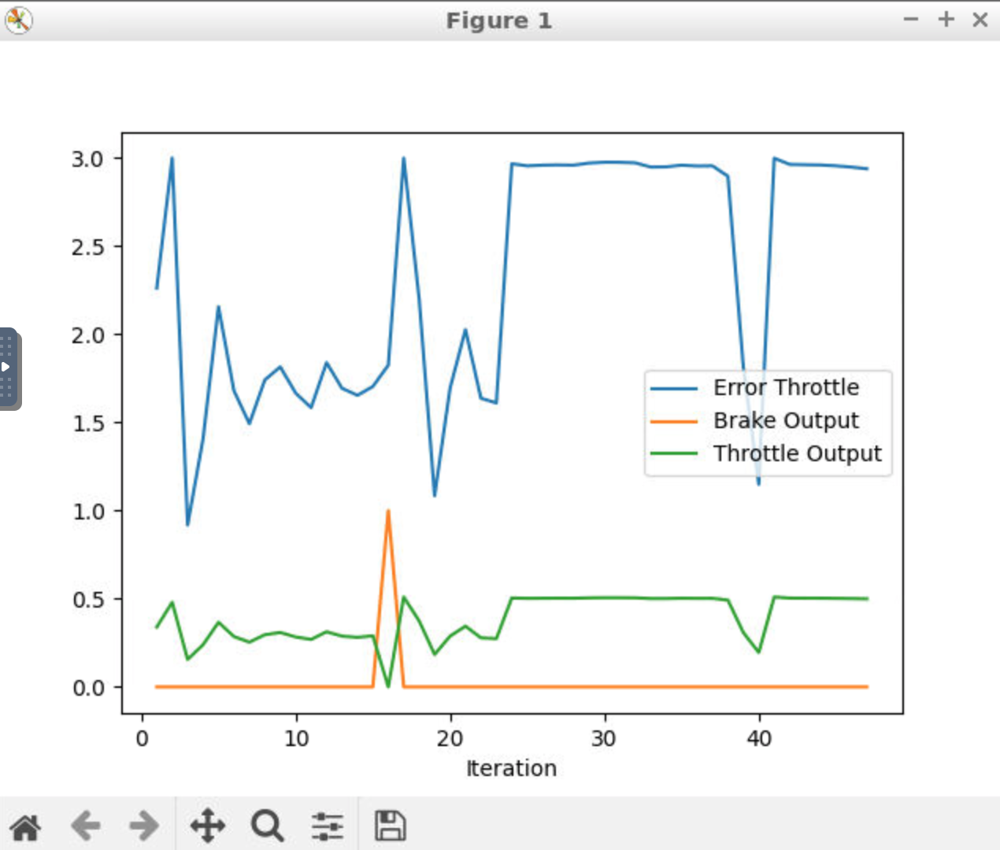
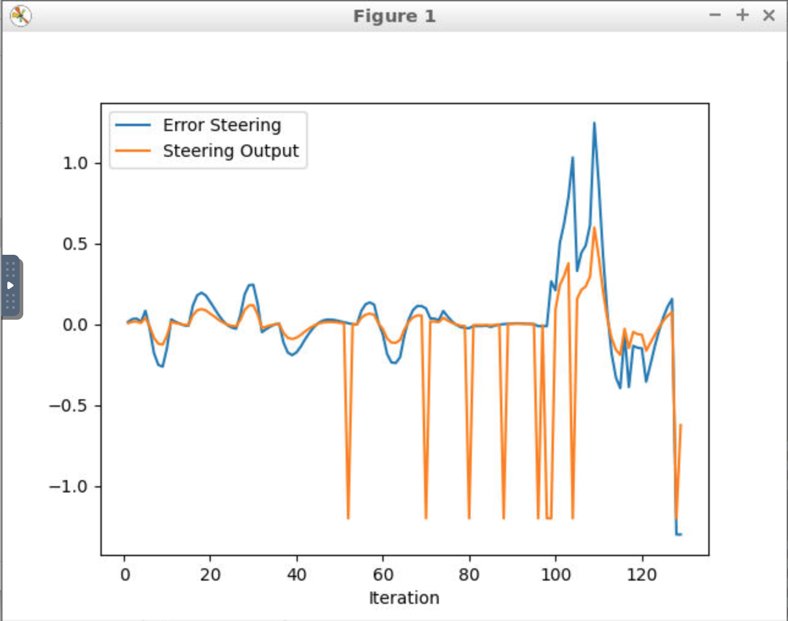
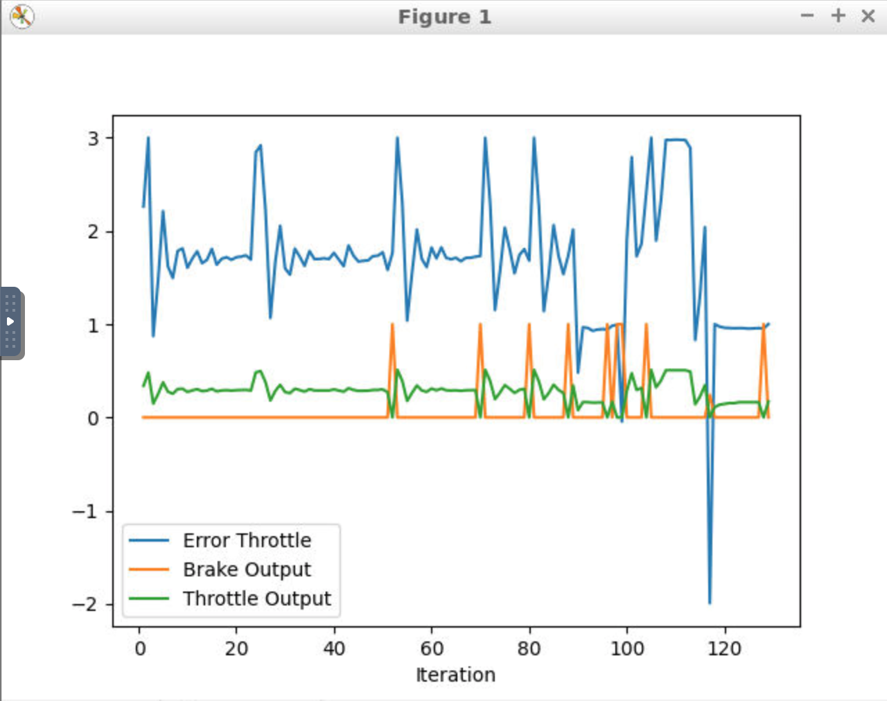
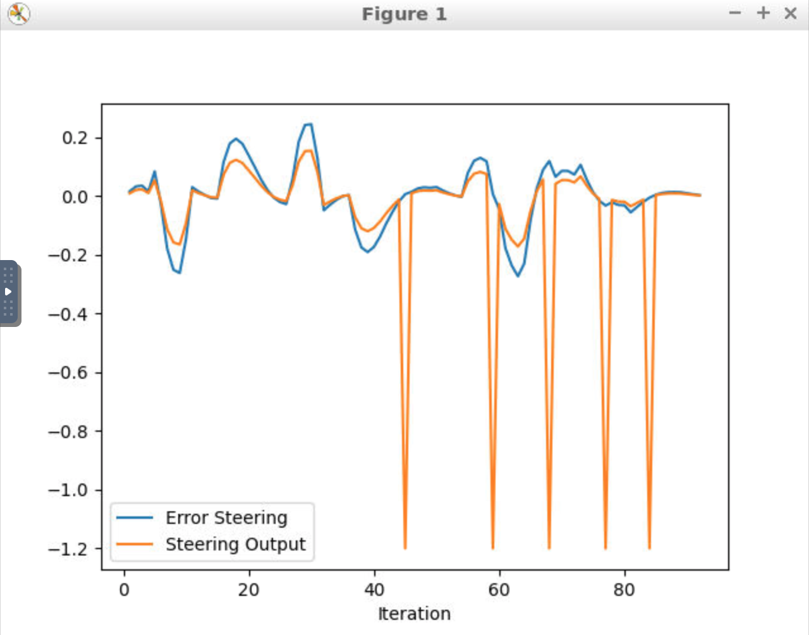
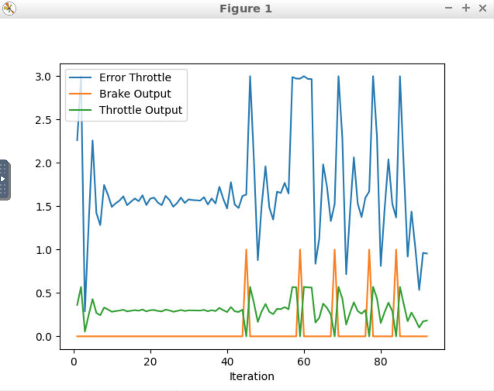

# Control and Trajectory Tracking for Autonomous Vehicle

# Proportional-Integral-Derivative (PID)

In this project, skills taught in this course to design a PID controller to perform vehicle trajectory tracking has been applied. Given a trajectory as an array of locations, and a simulation environment, PID controller is designed and coded and tested its efficiency on the CARLA simulator used in the industry.

# Testing results of PID Controller
PID Controller is tested with following four different parameters. 
|  TEST  | KP_STEER | KI_STEER | KD_STEER | KP_THROTTLE | KI_THROTTLE | KD_THROTTLE |
|:------:|:--------:|:--------:|:--------:|:-----------:|:-----------:|:-----------:|
| Test 1 |   0.1    |   0.0    |   0.0    |     0.1     |     0.0     |     0.0     |
| Test 2 |   0.45   |   0.02   |   0.25   |    0.18     |    0.01     |     0.1     |
| Test 3 |   0.5    |   0.02   |   0.3    |    0.18     |    0.01     |     0.1     |
| Test 4 |   0.65   |   0.02   |   0.3    |     0.2     |    0.01     |     0.1     |

Following is video recorded for test 4 which is the acceptable PID Controller parameters.
https://github.com/dilipkumar2k6/ml-udacity-project-nd013-c6-control-starter/blob/master/project/results/test4/test_4.mov

## PID Controller Test 1
Following params are used for Test 1

| KP_STEER | KI_STEER | KD_STEER | KP_THROTTLE | KI_THROTTLE | KD_THROTTLE |
|:--------:|:--------:|:--------:|:-----------:|:-----------:|:-----------:|
|   0.1    |   0.0    |   0.0    |     0.1     |     0.0     |     0.0     |

Following is plot based on steering values of the error and the pid command which are saved in [steer_pid_data.txt](project/results/test1/steer_pid_data.txt) 


Following is plot based on throttle values of the error and the pid command which are saved in [throttle_pid_data.txt](project/results/test1/throttle_pid_data.txt) 


Following is recorded video for this test.
https://www.youtube.com/watch?v=TCLZqVD__RI

### Observation
Car had collision therefore test 1 parameters are not acceptable.

## PID Controller Test 2
Following params are used for Test 2

| KP_STEER | KI_STEER | KD_STEER | KP_THROTTLE | KI_THROTTLE | KD_THROTTLE |
|:--------:|:--------:|:--------:|:-----------:|:-----------:|:-----------:|
|   0.45   |   0.02   |   0.25   |    0.18     |    0.01     |     0.1     |

Following is plot based on steering values of the error and the pid command which are saved in [steer_pid_data.txt](project/results/test2/steer_pid_data.txt) 


Following is plot based on throttle values of the error and the pid command which are saved in [throttle_pid_data.txt](project/results/test2/throttle_pid_data.txt) 


Following is recorded video for this test.
https://www.youtube.com/watch?v=TprTpD6pLXU

### Observation
Car had collision therefore test 2 parameters are not acceptable.

## PID Controller Test 3
Following params are used for Test 3

| KP_STEER | KI_STEER | KD_STEER | KP_THROTTLE | KI_THROTTLE | KD_THROTTLE |
|:--------:|:--------:|:--------:|:-----------:|:-----------:|:-----------:|
|   0.5    |   0.02   |   0.3    |    0.18     |    0.01     |     0.1     |

Following is plot based on steering values of the error and the pid command which are saved in [steer_pid_data.txt](project/results/test3/steer_pid_data.txt) 


Following is plot based on throttle values of the error and the pid command which are saved in [throttle_pid_data.txt](project/results/test3/throttle_pid_data.txt) 


Following is recorded video for this test.
https://www.youtube.com/watch?v=uD_XbfQDv2g

### Observation
Car had collision therefore test 3 parameters are not acceptable.

## PID Controller Test 4
Following params are used for Test 4

| KP_STEER | KI_STEER | KD_STEER | KP_THROTTLE | KI_THROTTLE | KD_THROTTLE |
|:--------:|:--------:|:--------:|:-----------:|:-----------:|:-----------:|
|   0.65   |   0.02   |   0.3    |     0.2     |    0.01     |     0.1     |

Following is plot based on steering values of the error and the pid command which are saved in [steer_pid_data.txt](project/results/test4/steer_pid_data.txt) 


Following is plot based on throttle values of the error and the pid command which are saved in [throttle_pid_data.txt](project/results/test4/throttle_pid_data.txt) 


Following is recorded video for this test.
https://www.youtube.com/watch?v=QY5nzZ_ucNo

### Observation
There was no collision therefore test 4 parameters are acceptable.

# Key Questions
## What is the effect of the PID according to the plots, how each part of the PID affects the control command?

- `P` ---> Proportional term: Produces an output value that is proportional to the current error value. A high proportional gain results in a large change in the output for a given change in the error.
- `I` ---> Integral term: Proportional to both the magnitude of the error and the duration of the error. The integral term accelerates the movement of the process towards setpoint and eliminates the residual steady-state error that occurs with a pure proportional controller.
- `D` ---> Derivative term: calculated by determining the slope of the error over time and multiplying this rate of change by the derivative gain. Derivative action predicts system behavior and thus improves settling time and stability of the system.

More detailed information: [PID controller](https://en.wikipedia.org/wiki/PID_controller#Proportional)

## How wouuld you design a way to automatically tune the PID parameters?
`Twiddle algorithm`:  The twiddle algorithm continuously tunes the PID controller's hyperparameters by analyzing the cross-track error and keeping track of the smallest CTE.

## PID controller is a model free controller, i.e. it does not use a model of the car. Could you explain the pros and cons of this type of controller?
PID can be used even a model is not available. It is a simple algorithm to implement and compute, because of that it suits to run on basic platforms.
Using single reference point in each step gives PID disadvantage to produce much better results.

# Installation

Run the following commands to install the starter code in the Udacity Workspace:

Clone the <a href="https://github.com/udacity/nd013-c6-control-starter/tree/master" target="_blank">repository</a>:

`git clone https://github.com/udacity/nd013-c6-control-starter.git`

# Run Carla Simulator

Open new window

* `su - student`
// Will say permission denied, ignore and continue
* `cd /opt/carla-simulator/`
* `SDL_VIDEODRIVER=offscreen ./CarlaUE4.sh -opengl`

# Compile and Run the Controller

Open new window

* `cd nd013-c6-control-starter/project`
* `./install-ubuntu.sh`
* `cd pid_controller/`
* `rm -rf rpclib`
* `git clone https://github.com/rpclib/rpclib.git`
* `cmake .`
* `make` (This last command compiles your c++ code, run it after every change in your code)

# Testing

To test your installation run the following commands.

* `cd nd013-c6-control-starter/project`
* `./run_main_pid.sh`
This will silently fail `ctrl + C` to stop
* `./run_main_pid.sh` (again)
Go to desktop mode to see CARLA

If error bind is already in use, or address already being used

* `ps -aux | grep carla`
* `kill id`


# Project Instructions

In the previous project you built a path planner for the autonomous vehicle. Now you will build the steer and throttle controller so that the car follows the trajectory.

You will design and run the a PID controller as described in the previous course.

In the directory [/pid_controller](https://github.com/udacity/nd013-c6-control-starter/tree/mathilde/project_c6/project/pid_controller)  you will find the files [pid.cpp](https://github.com/udacity/nd013-c6-control-starter/tree/mathilde/project_c6/project/pid_controller/pid.cpp)  and [pid.h](https://github.com/udacity/nd013-c6-control-starter/tree/mathilde/project_c6/project/pid_controller/pid.h). This is where you will code your pid controller.
The function pid is called in [main.cpp](https://github.com/udacity/nd013-c6-control-starter/tree/mathilde/project_c6/project/pid_controller/main.cpp).

## Step 1: Build the PID controller object
Complete the TODO in the [pid_controller.h](https://github.com/udacity/nd013-c6-control-starter/tree/mathilde/project_c6/project/pid_controller/pid_controller.h) and [pid_controller.cpp](https://github.com/udacity/nd013-c6-control-starter/tree/mathilde/project_c6/project/pid_controller/pid_controller.cpp).

Run the simulator and see in the desktop mode the car in the CARLA simulator. Take a screenshot and add it to your report. The car should not move in the simulation.
## Step 2: PID controller for throttle:
1) In [main.cpp](https://github.com/udacity/nd013-c6-control-starter/tree/mathilde/project_c6/project/pid_controller/main.cpp), complete the TODO (step 2) to compute the error for the throttle pid. The error is the speed difference between the actual speed and the desired speed.

Useful variables:
- The last point of **v_points** vector contains the velocity computed by the path planner.
- **velocity** contains the actual velocity.
- The output of the controller should be inside [-1, 1].

2) Comment your code to explain why did you computed the error this way.

3) Tune the parameters of the pid until you get satisfying results (a perfect trajectory is not expected).

## Step 3: PID controller for steer:
1) In [main.cpp](https://github.com/udacity/nd013-c6-control-starter/tree/mathilde/project_c6/project/pid_controller/main.cpp), complete the TODO (step 3) to compute the error for the steer pid. The error is the angle difference between the actual steer and the desired steer to reach the planned position.

Useful variables:
- The variable **y_points** and **x_point** gives the desired trajectory planned by the path_planner.
- **yaw** gives the actual rotational angle of the car.
- The output of the controller should be inside [-1.2, 1.2].
- If needed, the position of the car is stored in the variables **x_position**, **y_position** and **z_position**

2) Comment your code to explain why did you computed the error this way.

3) Tune the parameters of the pid until you get satisfying results (a perfect trajectory is not expected).

## Step 4: Evaluate the PID efficiency
The values of the error and the pid command are saved in thottle_data.txt and steer_data.txt.
Plot the saved values using the command (in nd013-c6-control-refresh/project):

```
python3 plot_pid.py
```

You might need to install a few additional python modules: 

```
pip3 install pandas
pip3 install matplotlib
```

Answer the following questions:
- Add the plots to your report and explain them (describe what you see)
- What is the effect of the PID according to the plots, how each part of the PID affects the control command?
- How would you design a way to automatically tune the PID parameters?
- PID controller is a model free controller, i.e. it does not use a model of the car. Could you explain the pros and cons of this type of controller?
- (Optional) What would you do to improve the PID controller?


## Tips:

- When you wil be testing your c++ code, restart the Carla simulator to remove the former car from the simulation.
- If the simulation freezes on the desktop mode but is still running on the terminal, close the desktop and restart it.
- When you will be tuning the PID parameters, try between those values:

